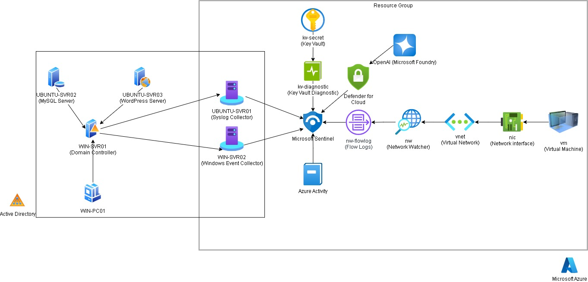

# Attack Simulation Lab

Simulate and detect real-world attack scenarios in a lab environment to strengthen infrastructure security practices.

This project was developed with inspiration from certificates I've taken - mainly the Offensive Security Certified Professional (OSCP) and the Microsoft Certified: Azure Security Engineer Associate (AZ-500). There are some security topics e.g. Active Directory, Microsoft Entra ID SSO and Defender for Containers that are covered in the course, but I didn't have the opportunity to experiment them.

Each scenario documents the attack steps, detection logic with KQL rules, and remediations, mapped to MITRE ATT&CK tactics and techniques.

## Architecture



> [!NOTE]
> Documented scenarios cover a subset of the infrastructure above. 
> Additional scenarios are in progress.

## Scenario
### Active Directory
| Scenario | MITRE ID | Tactic | Technique |
| -------- | -------- | ------ | --------- |
| [Kerberoasting](./scenarios/ad/kerberoasting/) | T1558.003 | Credential Access | Steal or Forge Kerberos Tickets: Kerberoasting   |
| [AS-REP Roasting](./scenarios/ad/asrep-roasting/) | T1558.004 | Credential Access | Steal or Forge Kerberos Tickets: AS-REP Roasting |

### Azure Key Vault
| Scenario | MITRE ID | Tactic | Technique |
| -------- | -------- | ------ | --------- |
| [Failed Key Vault Secret Access by Service Principal](./scenarios/azure/keyvault-access/) | T1555.006 | Credential Access | Credentials from Password Stores: Cloud Secrets Management Stores |

### Large Language Models (LLMs)
| Scenario | MITRE ID | Tactic | Technique |
| -------- | -------- | ------ | --------- |
| [Direct Prompt Injection](./scenarios/llm/direct-prompt-injection/) | T1190 | Initial Access | Exploit Public-Facing Application |
| [Indirect Prompt Injection](./scenarios/llm/indirect-prompt-injection/) | T1190 | Initial Access | Exploit Public-Facing Application |
| [OS Command Injection via LLM Tool Use](./scenarios/llm/os-command-injection/) | T1059 | Execution | Command and Scripting Interpreter |
| [RAG Poisoning](./scenarios/llm/rag-poisoning/) | T1565.001 | Impact | Data Manipulation: Stored Data Manipulation |
| [Training Data Poisoning](./scenarios/llm/training-data-poisoning/) | T1565.001 | Impact | Data Manipulation: Stored Data Manipulation |

## Infrastructure

Automation scripts and guides for building the lab environment.  
See [`infrastructure/`](infrastructure/) for full setup instructions.

| Platform | Features                                                    |
| -------- | ----------------------------------------------------------- |
| Windows  | AD Domain, Windows Event Collector and Forwarder, Azure Arc |
| Ubuntu   | AD Domain, rsyslog, MySQL, WordPress, Azure Arc             |
| Azure    | VM, VNet, Sentinel, Key Vault, OpenAI (Foundry)             |

## Quick Start

**Ansible**
```bash
ansible-playbook site.yml -i inventory.yml [-l win_dc]
```

**Terraform**
```bash
terraform init
terraform apply
```