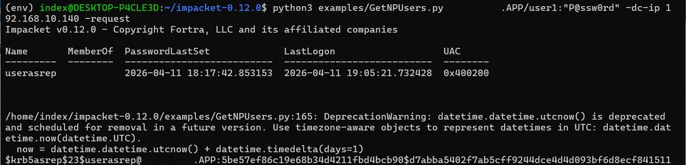
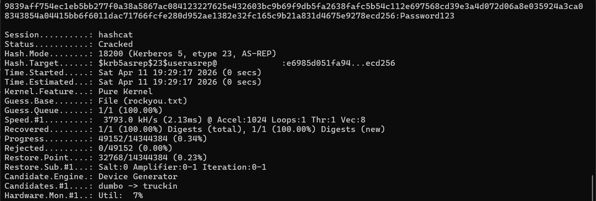
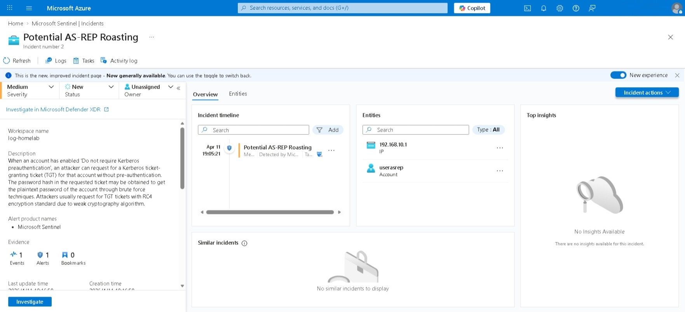

# AS-REP Roasting
**MITRE ATT&CK:** [T1558.004](https://attack.mitre.org/techniques/T1558/004/) — Steal or Forge Kerberos Tickets: AS-REP Roasting
**Platform:** Active Directory  
**Tactic:** Credential Access

## Description
AS-REP Roasting exploits accounts that have 'Do not require Kerberos preauthentication' enabled on the Active Directory Users and Computers.

When enabled and a Authentication Server Request (AS-REQ) for that account is requested to a domain controller, the pre-authentication validation is skipped and a Authentication Server Response (AS-REP) message is returned.

The AS-REP message contains:
- A blob containing session key and metadata, which is encrypted by user's password hash.
- Ticket-Granting Ticket (TGT).

The attack works as follows:
1. Enumerate accounts with the `DONT_REQ_PREAUTH` flag set on the `userAccountControl` attribute.
2. Send an AS-REQ to the domain controller for each target account, specifying RC4 encryption (0x17). The AS-REP is then returned.
3. Brute-force the encrypted blob offline to recover the plaintext password.

## Assumptions
The attacker is inside the AD network with an authenticated domain user account.

## Environment Setup
This scenario requires the Active Directory infrastructure. See [`infrastructure/ad/ansible`](../../../infrastructure/ad/ansible/) for provisioning a new instance - specifically the `win_createdomain` and `win_joindomain` tasks.

For threat detection in Sentinel, ensure that the Domain Controller instance is connected to Azure Arc and Data Collection Rule is configured. See [`infrastructure/ad/ansible`](../../../infrastructure/ad/ansible/) for connecting to Azure Arc - specifically the `win_azurearc` task and [`infrastructure/azure/terraform`](../../../infrastructure/azure/terraform/) for creating Data Collection Rule - specifically the `arc` module.

AS-REP Roasting requires an account with 'Do not require Kerberos preauthentication' enabled. Create a user and enable the option in Active Directory Users and Computers.

## Attack Steps
1. Enumerate vulnerable accounts and request AS-REP hashes using [Impacket's GetNPUsers.py](https://github.com/fortra/impacket):
```bash
GetNPUsers.py <domain>/<user>:<password> -dc-ip <1.2.3.4> -request
```
This returns AS-REP hashes in Hashcat-compatible format (`$krb5asrep$23$...`) for every account with pre-authentication disabled.



2. Crack the hash offline
```bash
hashcat -m 18200 hashes.txt /usr/share/wordlists/rockyou.txt
```
`-m 18200` targets Kerberos 5 AS-REP etype 23 (RC4-HMAC).



## Detections
The domain controller issues an AS-REP without verifying the requestor's identity when pre-authentication is disabled. The RC4 encryption type in the response is the key signal — accounts with pre-authentication disabled and a modern encryption policy should never be producing RC4 AS-REP tickets in normal operation.

**Event to monitor:** Windows Security Event ID 4768 (Kerberos authentication ticket (TGT) requested)  
**Filter for:** `TicketEncryptionType = 0x17` AND `PreAuthType = 0` (pre-authentication not required)

See [`detection.kql`](detection.kql) for the full Sentinel analytic rule.



## Remediation
- Enable Kerberos pre-authentication on all accounts — this should be the default; audit for accounts where it has been explicitly disabled
- If pre-authentication must be disabled for a legacy application, ensure the account has a strong, long password (25+ characters) that is infeasible to crack
- Monitor the `DONT_REQ_PREAUTH` flag via AD auditing — any change to this attribute on a user account should trigger an alert

## References
- [MITRE ATT&CK T1558.004](https://attack.mitre.org/techniques/T1558/004/)
- [Impacket GetNPUsers](https://github.com/fortra/impacket)
- [Microsoft: Kerberos Pre-Authentication](https://learn.microsoft.com/en-us/windows/security/threat-protection/auditing/event-4768)