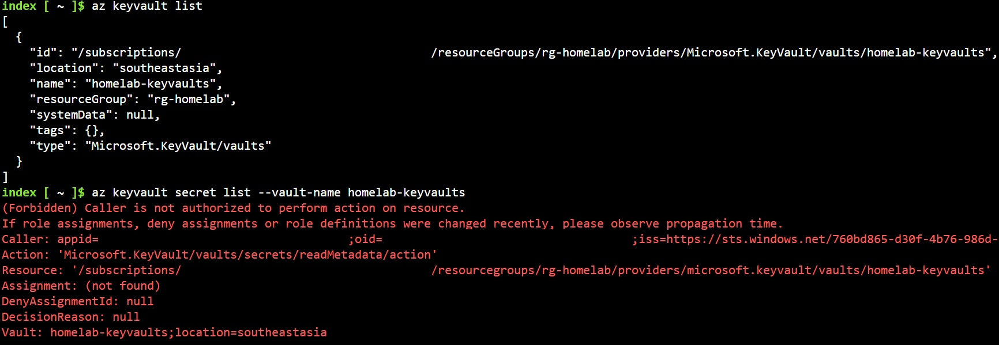
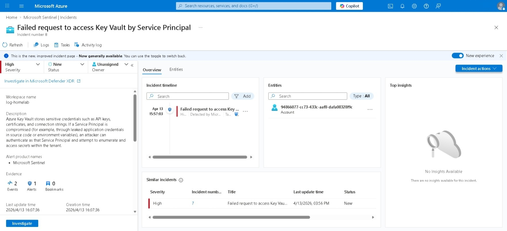

# Failed Key Vault Secret Access by Service Principal
**MITRE ATT&CK:** [T1555.006](https://attack.mitre.org/techniques/T1555/006/) — Credentials from Password Stores: Cloud Secrets Management Stores

**Platform:** Azure Key Vault  

**Tactic:** Credential Access

## Description
Azure Key Vault stores sensitive credentials such as API keys, certificates, and connection strings. If a Service Principal is compromised (for example, through leaked application credentials in source code or environment variables), an attacker can authenticate as that Service Principal and attempt to enumerate and access secrets within the tenant.

This scenario simulates a compromised Service Principal with `Reader` role attempting to list Key Vault resources and access secrets it is not authorised to read. The failed access attempt generates an audit log that can be detected in Microsoft Sentinel.

> [!NOTE]
> **What is a Service Principal?**  
> Similar to service accounts in Active Directory, a Service Principal is a non-human identity used by applications, services, and automation tools to authenticate to Azure resources.
> Compromised Service Principal credentials are a common target because they are often embedded in code, CI/CD pipelines, or configuration files.

## Assumptions
The attacker has obtained a Service Principal's Application ID, Client Secret, and Tenant ID (for example, from a leaked `.env` file, exposed repository, or compromised application server).

## Environment Setup
This scenario requires you to configure:

**Service Principal:**
- Created under Entra ID > App Registrations
- Client secret generated
- Assigned `Reader` role at the resource group scope (sufficient to enumerate Key Vault resources, but not to read secret values)

**Key Vault:**
- For threat detection in Sentinel,
  - Diagnostic settings enabled to forward audit logs `AzureDiagnostics` to the Log Analytics Workspace
- (Optional) A secret created inside the vault to trigger an access attempt

## Attack Steps

### 1. Authenticate as the compromised Service Principal
Using Azure Cloud Shell or Azure CLI, 
```bash
az login --service-principal \
  --username $appid \
  --password $secret \
  --tenant $tenant
```

### 2. Enumerate Key Vault resources in the tenant
```bash
az keyvault list
```
With `Reader` role at resource group scope, the attacker can discover Key Vault names and locations. This information is useful for targeting further access attempts.

### 3. Attempt to list secrets from the Key Vault
```bash
az keyvault secret list --vault-name homelab-keyvault
```

This fails with a `403 Forbidden` because `Reader` does not grant data plane access to Key Vault secrets. The attempt itself is still logged, and that failed request is exactly what the detection rule targets.



> [!NOTE]
> Generating the secret is optional. The Service Principal with the `Reader` role can list Key Vault resources but cannot access the contents of the Key Vault.

## Detections
Key Vault audit logs record every data plane operation, including failed ones. A Service Principal attempting to list or retrieve secrets it has no authorisation to access is a strong signal of either a compromised identity or an insider reconnaissance attempt.

**Log source:** `AzureDiagnostics` (Key Vault diagnostic logs forwarded to Log Analytics)  
**Filter for:** `ResultSignature = "Forbidden" and isRbacAuthorized_b == false` AND `identity_claim_idtyp_s = "app"` matching a known Service Principal (not a Microsoft-managed application ID)

See [`detection.kql`](detection.kql) for the full Sentinel analytic rule.



## Remediation
- **Use Key Vault access policies or Azure RBAC** to enforce least privilege. Service Principals should only be granted access to the specific secrets they need, not the entire vault.
- **Prefer Managed Identities over Service Principals** where possible. Managed Identities eliminate the need to manage and store Client Secrets entirely, removing the primary attack vector.
- **Rotate Client Secrets regularly** and immediately upon any suspected compromise. Short-lived secrets (90 days or less) limit the window of exposure.
- **Never store Client Secrets in source code or `.env` files.** Use a secrets manager or CI/CD secret injection instead.

## References
- [MITRE ATT&CK T1555.006](https://attack.mitre.org/techniques/T1555/006/)
- [Microsoft: Azure Key Vault Logging](https://learn.microsoft.com/en-us/azure/key-vault/general/logging)
- [Microsoft: Key Vault Security](https://learn.microsoft.com/en-us/azure/key-vault/general/security-features)
- [Microsoft: Managed Identities Overview](https://learn.microsoft.com/en-us/entra/identity/managed-identities-azure-resources/overview)